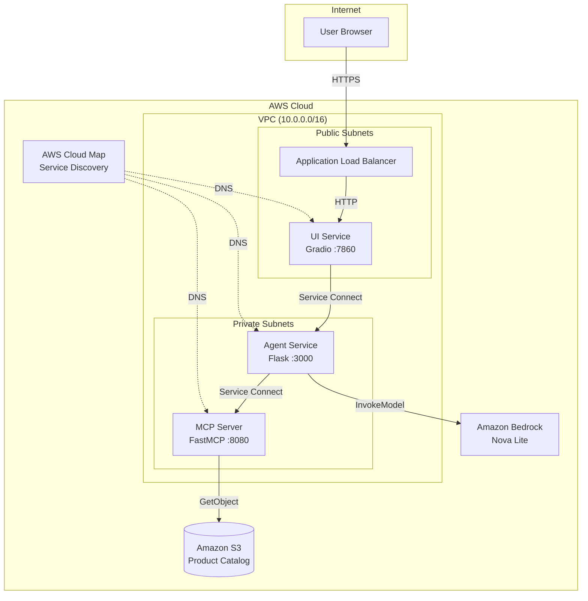
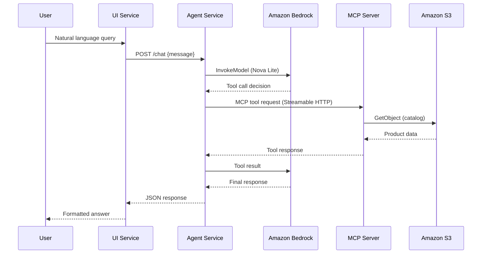
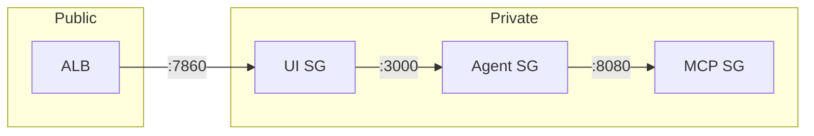

# Architecture Documentation

## System Architecture

## Request Flow

## Design Patterns

### Three-Tier Architecture
- **Presentation**: Gradio UI handles user interaction
- **Business Logic**: Strands Agent orchestrates AI reasoning
- **Data Access**: MCP Server abstracts S3 data operations

### Service Mesh (ECS Service Connect)
- Envoy sidecar proxies handle service discovery
- AWS Cloud Map provides DNS-based routing
- Traffic stays within VPC for security

### MCP Protocol
- Streamable HTTP transport for stateless request/response communication
- Tool-based abstraction for data operations
- Stateless request handling with in-memory catalog cache

## Security Architecture

### Security Controls
- **Network Isolation**: Private subnets for Agent and MCP Server
- **Security Groups**: Per-service ingress rules
- **IAM Roles**: Least-privilege task roles
- **KMS Encryption**: CloudWatch Logs and ECR repos
- **S3 TLS Enforcement**: Bucket policy denying non-HTTPS
