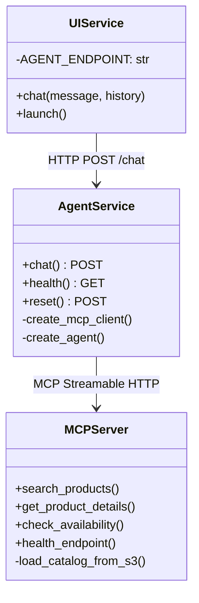

# Components Documentation

## Component Overview

## UI Service (`ui/app.py`)

**Purpose**: Web interface for natural language product queries

**Technology**: Gradio ChatInterface

**Key Functions**:
| Function | Description |
|----------|-------------|
| `chat(message, history)` | Sends query to Agent, returns response |

**Configuration**:
- `AGENT_ENDPOINT`: Agent service URL (default: `http://agent:3000`)
- Port: 7860

**Error Handling**: Timeout, connection, and HTTP errors with user-friendly messages

---

## Agent Service (`agent/app/agent.py`)

**Purpose**: AI orchestration between user queries and MCP tools

**Technology**: Flask + Strands Agents + Amazon Bedrock

**Endpoints**:
| Endpoint | Method | Description |
|----------|--------|-------------|
| `/chat` | POST | Process natural language query |
| `/health` | GET | Health check with MCP/Bedrock status |
| `/reset` | POST | Clear conversation history |

**Key Functions**:
| Function | Description |
|----------|-------------|
| `create_mcp_client()` | Creates Streamable HTTP client for MCP Server |
| `create_agent(mcp_client, conversation_id)` | Configures Strands Agent with Bedrock model |

**Configuration**:
- `MCP_SERVER_ENDPOINT`: MCP server URL (default: `http://mcp-server:8080`)
- `BEDROCK_MODEL_ID`: AI model (default: `global.amazon.nova-2-lite-v1:0`)
- Port: 3000

---

## MCP Server (`mcp-server/app/mcp_server.py`)

**Purpose**: Product catalog access via MCP protocol

**Technology**: FastMCP with Streamable HTTP transport

**MCP Tools**:
| Tool | Parameters | Description |
|------|------------|-------------|
| `search_products` | query, category, max_price, min_price, in_stock_only, features | Search with filters |
| `get_product_details` | product_id | Get single product |
| `check_availability` | product_id | Check stock status |

**HTTP Endpoints**:
| Endpoint | Method | Description |
|----------|--------|-------------|
| `/health` | GET | Health check with catalog status |
| `/mcp/` | POST | MCP Streamable HTTP transport endpoint |

**Key Functions**:
| Function | Description |
|----------|-------------|
| `load_catalog_from_s3()` | Loads product JSON from S3 into memory |
| `refresh_catalog()` | Reloads catalog and returns status |
| `get_catalog()` | Returns cached catalog, loading if needed |

**Configuration**:
- `S3_BUCKET`: Product catalog bucket
- `CATALOG_FILE`: JSON filename (default: `product-catalog.json`)
- Port: 8080

---

## Infrastructure (`cloudformation/infrastructure.yaml`)

**Purpose**: AWS resource provisioning

**Resources Created**:
- VPC with public/private subnets
- Internet Gateway + NAT Gateway
- ECS Cluster with Container Insights
- ECR Repositories (3)
- S3 Buckets (product catalog + access logs)
- IAM Roles (execution + task roles per service)
- Security Groups (per service)
- CloudWatch Log Groups
- KMS Key for encryption
- Cloud Map namespace for Service Connect
