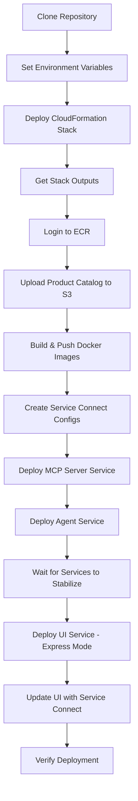
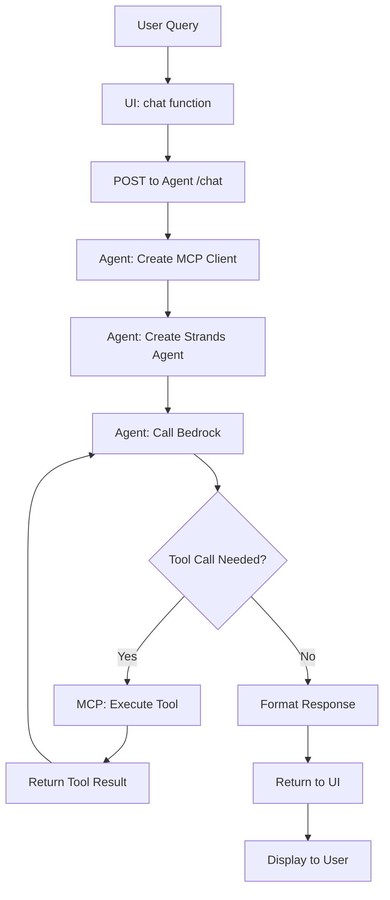
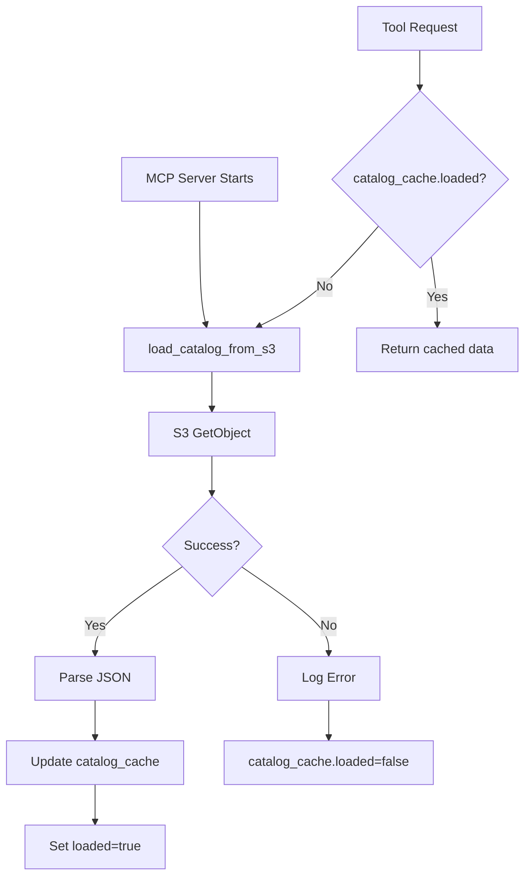
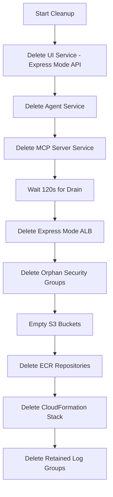
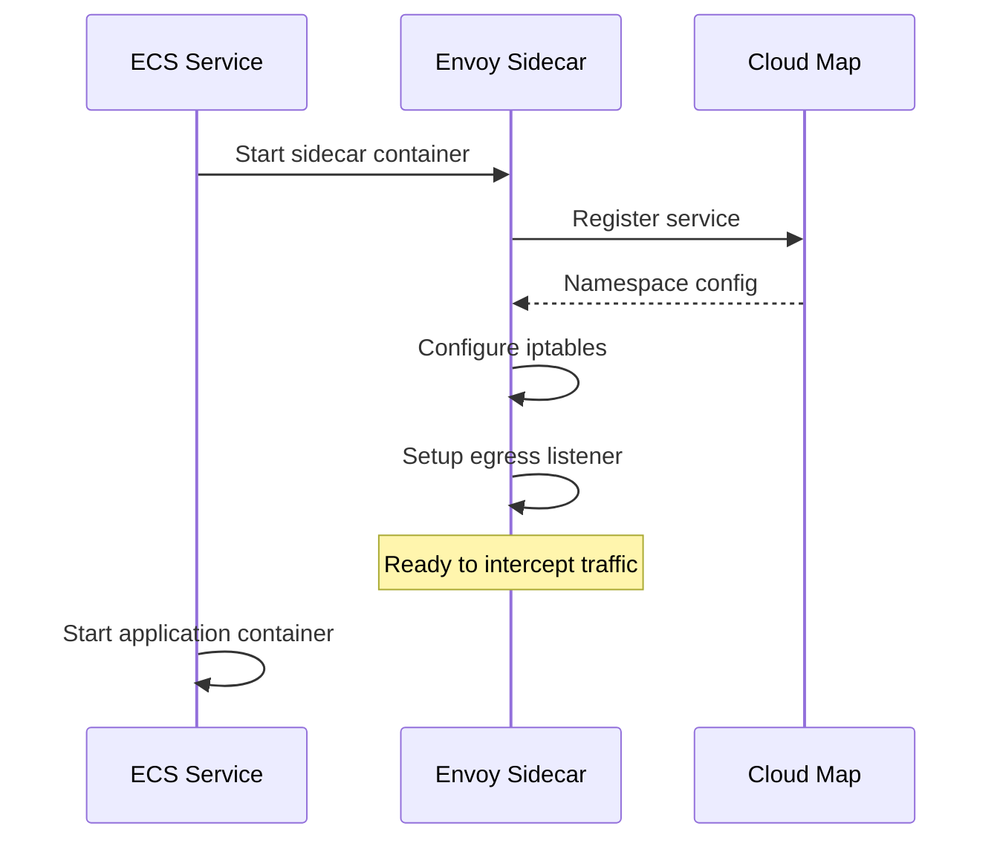

# Workflows Documentation

## Deployment Workflow

## Query Processing Workflow

## Catalog Loading Workflow

## Cleanup Workflow

## Service Connect Initialization

## Error Recovery Workflows

### Service Connect Failure
1. Check Envoy logs for cluster configuration
2. Verify Cloud Map namespace registration
3. Force service redeployment with `--force-new-deployment`
4. Wait for new task with fresh Envoy sidecar

### Bedrock Access Failure
1. Check Agent task role IAM policy
2. Verify inference-profile permissions
3. Update IAM policy via CloudFormation or direct API
4. No service restart needed (IAM changes immediate)
