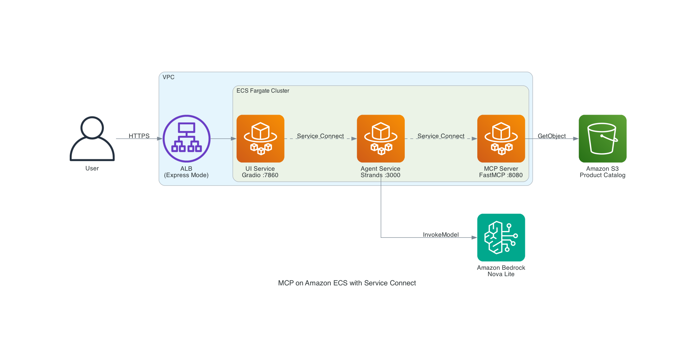

# MCP on Amazon ECS with Service Connect

This project demonstrates how to deploy Model Context Protocol (MCP) servers on Amazon Elastic Container Service (Amazon ECS) with AWS Fargate using Amazon ECS Service Connect for service-to-service communication. You build and deploy a three-tier application where a Gradio web interface sends natural language queries to an AI agent, which uses MCP tools to search a product catalog stored in Amazon Simple Storage Service (Amazon S3).

## Solution Architecture Overview



### Workflow

1. A user submits a natural language query (e.g., "Find laptops under $1000") through the **Gradio UI**, which is exposed to the internet via an Application Load Balancer provisioned by **Amazon ECS Express Mode**.
2. The UI forwards the request over **Amazon ECS Service Connect** to the **Agent Service** running in a private subnet.
3. The Agent invokes **Amazon Bedrock** (Nova Lite model) to interpret the query and determine which MCP tools to call.
4. The Agent connects to the **MCP Server** over **Amazon ECS Service Connect** using the Streamable HTTP transport.
5. The MCP Server executes the tool call — searching, filtering, or retrieving product data from an **Amazon S3** bucket.
6. The MCP Server returns results through the chain: MCP Server → Agent → UI → User.

All inter-service communication stays within the Amazon VPC. Only the UI service is publicly accessible.

### Key Components

| Component            | Technology                      | Role                                               |
| -------------------- | ------------------------------- | -------------------------------------------------- |
| **UI Service**       | Gradio on Amazon ECS            | Web chat interface, public-facing via ALB          |
| **Agent Service**    | Strands Agents + Amazon Bedrock | Orchestrates AI reasoning and MCP tool calls       |
| **MCP Server**       | FastMCP on Amazon ECS           | Exposes product catalog as MCP tools over Streamable HTTP      |
| **Service Connect**  | AWS Cloud Map + Envoy proxy     | Service-to-service discovery and routing           |
| **ECS Express Mode** | Managed ALB + auto-scaling      | Automated public endpoint with HTTPS               |
| **Product Catalog**  | Amazon S3                       | Stores product data as JSON                        |
| **Infrastructure**   | AWS CloudFormation              | Amazon VPC, subnets, IAM roles, Amazon ECS cluster |

## Prerequisites

- **AWS CLI v2 ≥ 2.32.0** — run `aws --version` to check
- **Docker ≥ 20.10** with buildx support — run `docker --version` to check
- **Git** — to clone the repository
- **jq** — run `jq --version` to check
- **Bash shell** — macOS/Linux terminal or [WSL](https://learn.microsoft.com/en-us/windows/wsl/install) on Windows
- **Amazon Bedrock model access** — enable the Amazon Nova Lite model in your AWS account via the [Amazon Bedrock console](https://console.aws.amazon.com/bedrock/home#/modelaccess)

## Directory Structure

```
├── cloudformation/
│   └── infrastructure.yaml      # Amazon VPC, Amazon ECS cluster, IAM roles, Amazon ECR repos
├── mcp-server/
│   ├── Dockerfile
│   ├── requirements.txt
│   └── app/mcp_server.py        # FastMCP server with S3 integration
├── agent/
│   ├── Dockerfile
│   ├── requirements.txt
│   └── app/agent.py             # Strands agent with Bedrock
├── ui/
│   ├── Dockerfile
│   ├── requirements.txt
│   └── app.py                   # Gradio chat interface
├── sample-data/
│   └── product-catalog.json     # Sample product data
├── scripts/
│   ├── setup-env.sh             # Export CloudFormation outputs as env vars
│   ├── generate-service-connect-configs.sh  # Generate Service Connect configs
│   └── cleanup.sh               # Resource cleanup script
└── docs/
    └── TROUBLESHOOTING.md       # Common issues and solutions
```


## Deployment

**Estimated deployment time:** 25-30 minutes

### Step 1: Clone Repository and Set Variables

```bash
git clone https://github.com/aws-samples/sample-mcp-server-on-ecs.git
cd sample-mcp-server-on-ecs

# Set your variables (modify these for your environment)
export STACK_NAME=ecs-mcp-blog
export AWS_REGION=us-west-2
export AWS_PROFILE=default
```

### Step 2: Deploy Infrastructure

The [AWS CloudFormation](https://aws.amazon.com/cloudformation/) template provisions all the infrastructure in a single stack: an [Amazon Virtual Private Cloud](https://aws.amazon.com/vpc/) (Amazon VPC) with public and private subnets across two Availability Zones, an [Amazon ECS](https://aws.amazon.com/ecs/) cluster with [AWS Fargate](https://aws.amazon.com/fargate/) capacity providers, [Amazon Elastic Container Registry](https://aws.amazon.com/ecr/) (Amazon ECR) repositories for the three container images, an [Amazon S3](https://aws.amazon.com/s3/) bucket for product data, [AWS Identity and Access Management](https://aws.amazon.com/iam/) (IAM) roles with least-privilege permissions, security groups that restrict traffic between services, and an [AWS Cloud Map](https://aws.amazon.com/cloud-map/) namespace for Service Connect discovery.

Using a single stack means you can deploy the entire environment with one command and tear it down cleanly when you're done.

```bash
aws cloudformation deploy \
  --template-file cloudformation/infrastructure.yaml \
  --stack-name $STACK_NAME \
  --capabilities CAPABILITY_NAMED_IAM \
  --region $AWS_REGION \
  --profile $AWS_PROFILE
```

**Validate:** Confirm the stack completed successfully before proceeding.

```bash
# Should output CREATE_COMPLETE
aws cloudformation describe-stacks \
  --stack-name $STACK_NAME \
  --region $AWS_REGION \
  --profile $AWS_PROFILE \
  --query 'Stacks[0].StackStatus' \
  --output text
```

> If the status is not `CREATE_COMPLETE`, check the events for errors:
> ```bash
> aws cloudformation describe-stack-events \
>   --stack-name $STACK_NAME \
>   --region $AWS_REGION \
>   --profile $AWS_PROFILE \
>   --query 'StackEvents[?ResourceStatus==`CREATE_FAILED`].[LogicalResourceId,ResourceStatusReason]' \
>   --output table
> ```

### Step 3: Get Stack Outputs

Run the provided setup script to export all CloudFormation stack outputs as environment variables. These variables are referenced in subsequent steps to deploy and configure the Amazon ECS services.

```bash
source scripts/setup-env.sh
```

You should see output confirming all variables are set. If any value shows empty or you see an error, verify the stack completed successfully in Step 2.

### Step 4: Login to Amazon ECR

Before you can push container images, Docker needs to authenticate with Amazon ECR. The following command retrieves a temporary authentication token and passes it to `docker login`.

```bash
aws ecr get-login-password --region $AWS_REGION --profile $AWS_PROFILE | \
  docker login --username AWS --password-stdin $ECR_REGISTRY
```

You should see `Login Succeeded` in the output. If you receive an authorization error, verify that your AWS CLI credentials have `ecr:GetAuthorizationToken` permission and that the `ECR_REGISTRY` variable from Step 3 is set correctly.

### Step 5: Upload Product Catalog

```bash
aws s3 cp sample-data/product-catalog.json s3://$S3_BUCKET/product-catalog.json \
  --region $AWS_REGION --profile $AWS_PROFILE
```

**Validate:**

```bash
# Should return product-catalog.json with size ~5 KiB
aws s3 ls s3://$S3_BUCKET/ --region $AWS_REGION --profile $AWS_PROFILE
```

### Step 6: Build and Push Docker Images

Each service has its own `Dockerfile` in its directory. The `--platform linux/amd64` flag is required because Amazon ECS with AWS Fargate runs Linux x86_64 containers. If you build on Apple Silicon (M1/M2/M3) without this flag, the task will fail at runtime with an exec format error. The `--push` flag combines the build and push into a single command.

```bash
# MCP Server
docker buildx build --platform linux/amd64 \
  -t $ECR_REGISTRY/${STACK_NAME}-mcp-server:latest \
  ./mcp-server --push

# Agent
docker buildx build --platform linux/amd64 \
  -t $ECR_REGISTRY/${STACK_NAME}-agent:latest \
  ./agent --push

# UI
docker buildx build --platform linux/amd64 \
  -t $ECR_REGISTRY/${STACK_NAME}-ui:latest \
  ./ui --push
```

**Validate:** Confirm all three images exist in Amazon ECR.

```bash
# Each should return an imageDigest — if empty, the push failed
for repo in mcp-server agent ui; do
  echo "--- ${STACK_NAME}-${repo} ---"
  aws ecr describe-images \
    --repository-name ${STACK_NAME}-${repo} \
    --region $AWS_REGION \
    --profile $AWS_PROFILE \
    --query 'imageDetails[0].[imageTags[0],imageSizeInBytes]' \
    --output text
done
```

### Step 7: Create Service Connect Config Files

Amazon ECS Service Connect uses [AWS Cloud Map](https://docs.aws.amazon.com/cloud-map/latest/dg/what-is-cloud-map.html) for service discovery and an [Envoy](https://www.envoyproxy.io/) sidecar proxy for traffic routing. Each service needs a JSON configuration that defines its discovery name, port mapping, and log destination. The MCP Server and Agent register themselves as discoverable endpoints so other services can reach them by name (for example, `http://mcp-server:8080`). The UI is a client-only consumer — it doesn't register itself but needs the Envoy sidecar to resolve the Agent's address.

Run the following script to generate the Service Connect configuration files for all three services:

```bash
./scripts/generate-service-connect-configs.sh
```

You should see output listing the three generated config files in `config/`.

### Step 8: Deploy Amazon ECS Services

You deploy the services in dependency order: MCP Server first (no upstream dependencies), then Agent (depends on MCP Server), and finally the UI (depends on Agent). The MCP Server and Agent run as standard Amazon ECS services in private subnets with no public IP addresses — Amazon ECS Service Connect handles all inter-service routing. The UI uses Amazon ECS Express Mode, which automatically provisions an Application Load Balancer, target group, and auto-scaling policy.

#### MCP Server Service

```bash
aws ecs create-service \
  --cluster $CLUSTER_NAME \
  --service-name mcp-server-service \
  --task-definition ${STACK_NAME}-mcp-server \
  --desired-count 2 \
  --launch-type FARGATE \
  --network-configuration "awsvpcConfiguration={subnets=[$PRIVATE_SUBNETS],securityGroups=[$MCP_SG],assignPublicIp=DISABLED}" \
  --service-connect-configuration file://config/${STACK_NAME}-mcp-server-service-connect.json \
  --region $AWS_REGION \
  --profile $AWS_PROFILE
```

#### Agent Service

```bash
aws ecs create-service \
  --cluster $CLUSTER_NAME \
  --service-name agent-service \
  --task-definition ${STACK_NAME}-agent \
  --desired-count 1 \
  --launch-type FARGATE \
  --network-configuration "awsvpcConfiguration={subnets=[$PRIVATE_SUBNETS],securityGroups=[$AGENT_SG],assignPublicIp=DISABLED}" \
  --service-connect-configuration file://config/${STACK_NAME}-agent-service-connect.json \
  --region $AWS_REGION \
  --profile $AWS_PROFILE
```

**Validate:** Wait for MCP Server and Agent to stabilize before deploying UI.

```bash
echo "Waiting 90 seconds for tasks to start..."
sleep 90

aws ecs describe-services \
  --cluster $CLUSTER_NAME \
  --services mcp-server-service agent-service \
  --region $AWS_REGION \
  --profile $AWS_PROFILE \
  --query 'services[].[serviceName,status,runningCount,desiredCount]' \
  --output table
```

Both services should show `runningCount: 1`. If `runningCount` is 0, check for task failures:

```bash
TASK_ARN=$(aws ecs list-tasks --cluster $CLUSTER_NAME --service-name mcp-server-service \
  --desired-status STOPPED --region $AWS_REGION --profile $AWS_PROFILE \
  --query 'taskArns[0]' --output text)

if [ "$TASK_ARN" != "None" ] && [ -n "$TASK_ARN" ]; then
  aws ecs describe-tasks --cluster $CLUSTER_NAME --tasks $TASK_ARN \
    --region $AWS_REGION --profile $AWS_PROFILE \
    --query 'tasks[0].[stoppedReason,containers[].reason]' --output text
else
  echo "No stopped tasks found for mcp-server-service"
fi
```

#### UI Service (Express Mode)

The UI service uses ECS Express Mode, which provisions an Application Load Balancer automatically. Deploy it in three steps:

**Create the UI service:**

```bash
aws ecs create-express-gateway-service \
  --cluster $CLUSTER_NAME \
  --service-name ui-service \
  --execution-role-arn $EXECUTION_ROLE \
  --infrastructure-role-arn $INFRA_ROLE \
  --primary-container "{
    \"image\": \"${UI_ECR}:latest\",
    \"containerPort\": 7860,
    \"awsLogsConfiguration\": {
      \"logGroup\": \"${UI_LOG_GROUP}\",
      \"logStreamPrefix\": \"ecs\"
    },
    \"environment\": [
      {\"name\": \"AGENT_ENDPOINT\", \"value\": \"http://agent:3000\"}
    ]
  }" \
  --task-role-arn $UI_TASK_ROLE \
  --network-configuration subnets=$PUBLIC_SUBNETS,securityGroups=$UI_SG \
  --cpu "256" \
  --memory "512" \
  --scaling-target minTaskCount=1,maxTaskCount=4,autoScalingMetric=AVERAGE_CPU,autoScalingTargetValue=70 \
  --tags key=Project,value=ECS-MCP-Blog \
  --region $AWS_REGION \
  --profile $AWS_PROFILE
```

**Wait for the service to stabilize (~4 minutes):**

```bash
aws ecs wait services-stable \
  --cluster $CLUSTER_NAME \
  --services ui-service \
  --region $AWS_REGION \
  --profile $AWS_PROFILE
```

**Add Service Connect (required for UI to reach Agent):**

```bash
aws ecs update-service \
  --cluster $CLUSTER_NAME \
  --service ui-service \
  --service-connect-configuration file://config/${STACK_NAME}-ui-service-connect.json \
  --force-new-deployment \
  --region $AWS_REGION \
  --profile $AWS_PROFILE
```

> **Note:** Express Mode does not support Service Connect on initial creation. The update step adds the Envoy sidecar needed for UI to communicate with Agent via `http://agent:3000`.

**Wait for the Service Connect deployment to complete (~6 minutes):**

Express Mode uses canary deployments with a bake period. The following command waits until the new task (with Service Connect) is stable and the old task has drained:

```bash
aws ecs wait services-stable \
  --cluster $CLUSTER_NAME \
  --services ui-service \
  --region $AWS_REGION \
  --profile $AWS_PROFILE
```

### Step 9: Verify Deployment

```bash
# Check service status
aws ecs describe-services \
  --cluster $CLUSTER_NAME \
  --services mcp-server-service agent-service ui-service \
  --region $AWS_REGION \
  --profile $AWS_PROFILE \
  --query 'services[].[serviceName,status,runningCount,desiredCount]' \
  --output table
```

All three services should show `ACTIVE` with `runningCount` matching `desiredCount`:

```
--------------------------------------------
|             DescribeServices             |
+---------------------+---------+----+-----+
|  mcp-server-service |  ACTIVE |  2 |  2  |
|  agent-service      |  ACTIVE |  1 |  1  |
|  ui-service         |  ACTIVE |  1 |  1  |
+---------------------+---------+----+-----+
```

> **⚠️ If `ui-service` shows `2/1` (runningCount > desiredCount):** The canary deployment is still in progress. Wait a few more minutes and re-run the command. Do not proceed until all services show matching counts.

```bash
# Get UI public URL via Express Mode API
UI_SERVICE_ARN=$(aws ecs describe-services --cluster $CLUSTER_NAME --services ui-service \
  --region $AWS_REGION --profile $AWS_PROFILE \
  --query 'services[0].serviceArn' --output text)

UI_ENDPOINT=$(aws ecs describe-express-gateway-service \
  --service-arn $UI_SERVICE_ARN \
  --region $AWS_REGION --profile $AWS_PROFILE \
  --query 'service.activeConfigurations[0].ingressPaths[0].endpoint' --output text)

echo "UI URL: https://${UI_ENDPOINT}/"
```

### Step 10: Test the Application

Open the UI URL in your browser. You should see a Gradio chat interface with a text input field. Try the following queries to verify the end-to-end flow through all three services:

- "Show me electronics under $100"
- "What laptops do you have?"
- "Find running shoes in stock"

Each query travels the full chain: the UI sends it to the Agent over Amazon ECS Service Connect, the Agent calls Amazon Bedrock to decide which MCP tools to invoke, the MCP Server searches the product catalog in Amazon S3, and the results flow back to the user. Responses typically take 3–5 seconds on the first query while the MCP Server loads the catalog from Amazon S3.

If the UI loads but queries return errors, check the Agent and MCP Server logs:

```bash
# Agent logs — look for Amazon Bedrock or MCP connection errors
aws logs tail /ecs/${STACK_NAME}/agent --since 10m \
  --region $AWS_REGION --profile $AWS_PROFILE

# MCP Server logs — look for Amazon S3 or startup errors
aws logs tail /ecs/${STACK_NAME}/mcp-server --since 10m \
  --region $AWS_REGION --profile $AWS_PROFILE
```


## Cleanup

> **Important:** This deployment creates billable AWS resources. Run the cleanup script to remove all resources and avoid ongoing charges.

### Run the Cleanup Script

The cleanup script removes all resources in the correct order: Amazon ECS services, Express Mode resources, Amazon S3 buckets, Amazon ECR repositories, the AWS CloudFormation stack, and retained log groups.

```bash
# Verify your deployment variables are set
export STACK_NAME=ecs-mcp-blog
export AWS_REGION=us-west-2
export AWS_PROFILE=default

# Run cleanup
./scripts/cleanup.sh
```

The script will:
1. Delete all Amazon ECS services in parallel
2. Wait for services to drain
3. Remove Express Mode ALB and orphan security groups
4. Empty Amazon S3 buckets (including versioned objects)
5. Delete Amazon ECR repositories
6. Delete the AWS CloudFormation stack
7. Remove retained [Amazon CloudWatch](https://aws.amazon.com/cloudwatch/) log groups

If any step fails, the script continues and reports failures at the end with links to the AWS Console for manual cleanup.

### Manual VPC Cleanup (if needed)

If the AWS CloudFormation stack deletion fails on the Amazon VPC resource (for example, due to lingering ENIs or dependencies), you can manually delete the Amazon VPC:

1. Open the [Amazon VPC console](https://console.aws.amazon.com/vpc/).
2. Select the Amazon VPC tagged with your stack name.
3. Choose **Delete VPC** to remove the Amazon VPC and its associated subnets, route tables, and internet gateways.


## Troubleshooting

### Service Connect Issues

If the UI cannot connect to the Agent, redeploy with Service Connect:

```bash
aws ecs update-service \
  --cluster $CLUSTER_NAME \
  --service ui-service \
  --service-connect-configuration file://config/${STACK_NAME}-ui-service-connect.json \
  --force-new-deployment \
  --region $AWS_REGION \
  --profile $AWS_PROFILE
```

### View Logs

```bash
# MCP Server logs
aws logs tail /ecs/${STACK_NAME}/mcp-server --follow --region $AWS_REGION --profile $AWS_PROFILE

# Agent logs
aws logs tail /ecs/${STACK_NAME}/agent --follow --region $AWS_REGION --profile $AWS_PROFILE

# UI logs
aws logs tail /ecs/${STACK_NAME}/ui --follow --region $AWS_REGION --profile $AWS_PROFILE
```

For detailed troubleshooting guidance, including root cause analysis for common issues, see [docs/TROUBLESHOOTING.md](docs/TROUBLESHOOTING.md).

## Security

See [CONTRIBUTING](CONTRIBUTING.md#security-issue-notifications) for more information.

## License

This library is licensed under the MIT-0 License. See the LICENSE file.

## Conclusion

You have deployed a three-tier MCP application on Amazon ECS with AWS Fargate, with Amazon ECS Service Connect handling service-to-service communication. The architecture uses Amazon Bedrock for AI inference, FastMCP for tool serving, and Gradio for the web interface. To extend this project, you can add more MCP tools to the server, swap the AI model, or integrate additional data sources through Amazon S3.
